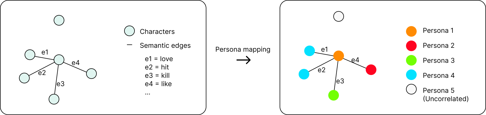

# Unveiling Character Dynamics: A Quantitative Exploration of Movie Narratives
Let's RollTheDataDice!
## Table of Contents
- [Structure of this repository](#structure-of-this-repository)
- [Abstract](#abstract)
- [Research Questions](#research-questions)
- [Additional dataset](#additional-datasets)
- [Methods](#methods)
- [Initial Analysis](#initial-analysis)
- [Schedule](#timeline)
- [Team Collaboration](#team-collaboration)

## Structure of this repository
```
+---data                               # Used to put the raw data
|   \---corenlp_plot_summaries         # Tagged data from Stanford CoreNLP-processed summaries
|   character.metadata.tsv
|   movie.metadata.tsv
|   name.clusters.txt
|   plot_summaries.txt

+---generated                          # Store the manipulated data
|   \images
|   \tropes                            # Crawled data from tvtropes

+---src                                # All the codes
|   movie_metadata_eda.ipynb           # Initial analysis on the movie_metadata.tsv

\---temp                               # Temporary files
```
## Abstract
Our project aims to address the critical gap in film analysis by quantitatively investigating character dynamics based on our dataset. We focus on identifying prevalent patterns among main and side characters, dissecting gender dynamics, and possibly exploring psychoanalytic dimensions. Further, after extracting the semantic character network for each film, we endeavor to reveal recurring themes, archetypes, and behavioral patterns that construct these character networks to discern genre-specific tropes. By unraveling the intricate relationships between characters, we hope to provide insights to better understand the craft of storytelling in the ever-evolving landscape of cinema. 


## Research Questions
For our analytical framework, we first extract three main factors from movie metadata that might influence the character dynamics:  temporal, geographical, and genre-related ones.
### Single character
To start with, we'd like to probe into single characters.
#### Main characters
1. What are the most common behavioral and personality patterns exhibited by main characters? Do they reflect anything about the public psychology?
2. More specifically, how do these patterns evolve over time and differ across regions and genres? Are there any cultural or social implications behind?
#### Side characters
3. Similarly, what are the most common behavioral and personality patterns exhibited by side characters?
4. Again, how do these patterns evolve over time and differ across regions and genres?
### Network graph
Then, we get the semantic character network graph from each movie, in which every node represents the characters and the edges represent the events (verbs) linking the characters.
#### Character interactions
5. What are the common interaction patterns and relationships that unfold among main characters?
6. How do main characters typically engage with side characters, and what roles do side characters play in influencing the storyline?
7. Are there distinctive patterns in the portrayal of relationships between characters in movies of different times, and from different regions?
#### Gender dynamics
8. What are the most prevalent interaction patterns between characters of the same gender, and how do these patterns vary across genres? Could we uncover any clues about gender politics embodied in the movies?
9. What is the distribution of male and female characters in main/side roles across different movie genres, and are there notable disparities?
10. Are there specific genres where the dynamics of male main/side characters significantly contrast with those of female main/side characters, and vice versa?
11. Perhaps it could be extended to factors like age, ethnicity, and so on.
#### Graph comparison
12. Can we classify these network graphs based on their geometrical and semantic features? And what can we learn from the classification results? Would they fit into different genres, maybe? Or different narrative structures?


## Methods

Our idea involves many steps.
1. Extraction of character tropes for 1000 films from the website TVTropes
2. Execute the pipeline from the paper of the "Learning Latent Personas of Film Characters" paper
3. (Optional) Inference of character tropes for the rest of the films in the dataset through a classification model
4. Creation of character dynamics network for each film
5. Comparison and clustering of these networks
6. Final analysis on tropes and networks

#### 1.(Optional) Extraction of character tropes
Our first task would be scrape the website of the Character tropes, as described in the previous "Additional datasets" section. 
We would use libraries such as BeautifulSoup and Selenium.

#### 2. Execute the pipeline from the paper of the Character Personas
Our goal for this step is to obtain the adjectives/nouns list associated with each character. To do this, we plan to run the entire pipeline of [this repository](https://github.com/dbamman/ACL2013_Personas/tree/master). 
We are aware it's heavy computationally, we plan to make it by next week.
#### 3. (Optional) Inference of character tropes for the rest of the films in the dataset through a classification model

To address the limitation of tropes being available for only 1000 films we plan to design a classification model. 

The training data includes characters associated with tropes, which are then joined with "persona" classes. The objective is to predict character tropes for unlabeled data using the list of words associated with persona classes as features, treating it as a text classification problem. 

Techniques such as TF-IDF for numerical representation of adjectives and a language model like BERT are planned to be used. Potential challenges include class imbalance, especially with certain tropes, and concerns about the model's performance. 
If these challenges prove insurmountable, we may focus solely on the subset of 1000 films in the dataset.

#### 4. Creation of character dynamics network for each film

4.1. *Semantic Tagging*
This part has been done by [Stanford CoreNLP-processed summaries](https://www.cs.cmu.edu/~ark/personas/data/corenlp_plot_summaries.tar). The tagged data is stored in XML format.

#### 5. Semantic character network comparison
We define our character network as $G = (V, E)$, where the vertices represent the characters in the plot and the edges represent the interaction between the two characters. After constructing this network, we map each character to specific personas, as depicted in the diagram below.



After we get the persona network for each film, we "rebuild" the plot through theses networks. Our objective is to compare the similarity (or difference) between these networks, focusing on two aspects: node and edge overlaps. The following image demonstrates two networks with certain overlaps in both nodes and edges. We will use the Jaccard index [[1]](https://en.wikipedia.org/wiki/Jaccard_index) to compute the node set similarity and the edge set similarity.
$$J(A,B) = {{|A \cap B|}\over{|A \cup B|}} = {{|A \cap B|}\over{|A| + |B| - |A \cap B|}}$$

#### 6. Final analysis on tropes and networks


## Initial analysis
We did initial EDA for our movie metadata and character metadata to understand in which decades the films were made, the genre distribution, country of origin, movie language, character age, height, and so on.

Because of the strong bias towards American films in the dataset, we discarded our idea about movies and cultures.
See `movie_metadata_eda.ipynb` in the `src` folder for more details.

## Timeline
| Time         | Task                   | Status  |
|--------------|----------------------- |---------|
| 17, Nov      | EDA, Proposal writing  |✅       |
| 24, Nov      | Parse the XML files    |         |
| 31, Nov      | Persona clustering     |         |
| 7, Dec       | Network analysis       |         |
| 14, Dec      | Build the network      |         |
| 21, Dec      | Finalize the story     |         |

## Team organization

| Member       | Tasks                 |
|--------------|-----------------------|
| Mehdi        | Build the network      |
| Yanzi        | Crawl tropes          |
| Jiaming      | Metadata analysis     |
| David        | Final data analysis   |
| Ke           | Metadata analysis     |


