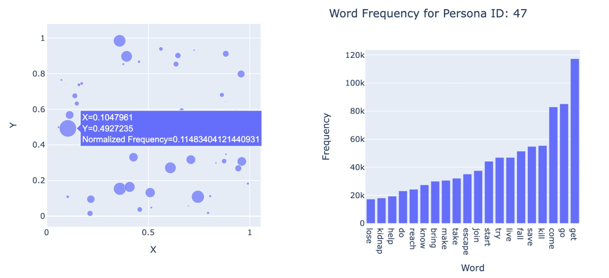

Welcome to the captivating world where stories unfold, emotions intertwine, and characters come to life on the silver screen! Our project sets out on a riveting journey through the heart of cinema, seeking to decode the intricate dance of characters within the vast tapestry of movie plot summaries.

In the grand tradition of narrative storytelling, characters serve as the beating heart of every cinematic masterpiece. Beyond their individual narratives, the dynamics between characters shape the essence of storytelling, steering plots towards climactic peaks, heartwarming resolutions, or tragic conclusions.

Why is understanding character dynamics so crucial? Well, as storytelling enthusiasts, filmmakers, and data enthusiasts alike, we believe that unraveling the patterns of character interactions unveils the very essence of cinematic storytelling. Characters are not mere entities; they are conduits through which narratives breathe, conveying emotions, conflicts, and resolutions.

Buckle up as we begin the odyssey through the realms of persona distributions, intricate character networks, and the pulsating rhythm of cinematic evolution! 🚀 Are you ready to peer into the soul of cinema and witness the magic that unfolds when characters take center stage? Let the curtain rise, and let the data story begin! 🌟

## <a id="section_1">Understanding Individual Characters</a>
### Peering into the Essence of Characters: A Journey into Personas

This is the beginning of our cinematic exploration, where characters reveal their individuality through distinct personas. Now, let's delve into the latent behavioral and personality patterns that define characters before walking along their narrative pathways.

#### What are Personas?

In the realm of film, personas encapsulate a blend of distinctive traits by which the fictional characters are shaped. The audience would often identify what a character is like by their persona, for example, the hero or the villain. In our cases, personas can be in more specific terms, like characters' behavioral and personality petterns. After regression, we classified all the characters into 50 types of personas, indicated by a code from 0 to 49.In films, personas encapsulate a blend of distinctive multifaceted traits by which the fictional characters are shaped. The audience would often use the persona to effectively identify what a character is like, for example, the hero or the villain. In our cases, personas can be more specific. After regression analysis, we classified all the characters into 50 types of personas, indicated by a code from 0 to 49.

  
Show more

  
We get the personas by running the pipeline outlined in the "Learning Latent Personas of Film Characters" paper [Link](https://github.com/dbamman/ACL2013_Personas/tree/master?tab=readme-ov-file). 
   

 

We can take a look at the most associated words for each persona to get a basic impression.


 
Besides, let's check the 2-d mapping of the 50 personas where closer distance means similar attributes and bigger size means more appearances in the film dataset.  It is evident that certain persona clusters are more prevalent than others, though overall, the classifications do not exhibit significant imbalance.

  
Show more

  
Due to some technical issues, we are not able to display the graph in an interactive way. On the left side is the 2-d mapping of the 50 personas. Closer distance means they have similar attributes. Bigger size means they appear more in the film dataset. On the right side we have the word frequency within each persona type. Here we take the screenshot of persona 47, the most common personas for male characters in our dataset.
   

     

Also, how each persona (of both gender) is distributed among different genres:



As we can see, persona 10 appears more in Romantic Comedy, Romance Film, Drama and Comedy; while persona 47 is more often seen in Thriller, Drama, Crime Fiction, Action.

#### Gendered Personas: Navigating Binary Essences

Our journey begins by dissecting the personas of characters based on gender. What are the most common behavioral archetypes for male and female characters? 

  
Show more

  
Actually we don't really have gender information about the characters. We could only use the corresponding actor's gender instead, which might bring trivial error.
   

 


We can see from the graph, persona 10 and persona 47, which are the top 2 personas, both show great gender discrepancy. (bear in mind that there are actually way more male characters than female characters). Proportionally, just like persona 10, persona 0, 23, 33, 43 all have much more female than male. By contrast, more male are found in persona 3, 5, 40, as in persona 47.

As the cinematic timeline unfolds, do we witness an evolution in these archetypes, reflecting changing societal norms?



When temporal factor are also taken into account, it's obvious that male characters and female characters have quite different evolving patterns over time.

Zooming in, we explore the nuances of personas within different genres. Does the stereotypical persona of a male or female character change when the stage is set in a romance, action, or sci-fi setting?



Among the top 10 genres, both male and female characters display various persona distribution. It's interesting to note that comparatively male characters tend to have more diverse personas than female characters. But if we take a closer look at male characters alone,  we can see that they are portrayed more sterotypically in Crime Fiction, Thriller and Action. While female characters are quite likely to be of persona 10 in Drama, Blackandwhite, Romance Film, Indie and Comedy.

#### Character Type Personas: Main Stage vs. Side Story

As we shift our gaze to character types, the question arises: do main and side characters typically share similar personas, or do their behavioral archetypes diverge?



Unlike the gender bias, with most personas, main characters and side characters are quite similar.

Then, does it vary over time?



Again, from both graphs above, it seems there's no obviously giant difference in main and side characters' personas in terms of their types and trends.

#### Closing the Curtain: A Persona-Painted Prelude

As we draw the curtain on this first part of our data story, the personas of individual characters emerge as the backdrop, setting the stage for the intricate interactions that follow. Join us in the next act as we shift our focus from individual character nuances to the dynamic dance of personas in the realm of character interactions.

 

## <a id="section_2">Interaction Analysis by Gender</a>

#### From Personas to Partnerships: Harmony and Discord on the Silver Screen

Having delved into the individual personas that shape the characters, we now turn our gaze towards the dynamic partnerships and interactions that unfold on the silver screen. In this chapter, we explore how the distinctive personas we unveiled in the previous act come to life in the intricate dance of gendered character interactions.

####  Gendered Symphony of Character Interactions

🌐 Mapping the Cinematic Web:
To unravel the secrets of character interactions, we build the movie networks. Each film's plot summary transforms into a complex tapestry of relationships, woven into a network graph. Characters become nodes, and their interactions form the connecting threads. This network allows us to visualize the intricate dynamics between characters, offering a unique lens through which we decode the gendered symphony of cinematic storytelling. Here we show an example.



  
Show more

We use SpaCy to get the NER tags in each sentence. Then we parse each sentence to get the get Subject-Verb-Object (SVO) triples. We use only keep the triples whose subject is a character and the object is also a character. We then use the subject and object as the nodes and the verb as the edge.

 
🌟 Unveiling the Gender Dynamics:
Picture this – a tapestry of character interactions where male and female protagonists engage in a harmonious ballet of emotions. Our analysis has unraveled the most common interactions between characters of the same gender. Do they share tender moments of camaraderie or clash in the tempest of conflicts? Let's see the results we observed from our character interaction dynamics. Here we go one step further by mapping the "verb" interaction to some more general relationships.
 
 

  
Show more

We manually define some most common interactions, including love, fight, reject, fear, care, etc. We get the word embedding for these words, and pick 50 most related words in the semantic space. Then we map the "verb" edges to these more general words. In this way, we can get as much relationship clusters as what we want.

 



Analyzing our data reveals a pronounced bias toward heterosexual relationships, with characters of opposite sexualities exhibiting a higher likelihood of engaging in romantic interactions. Notably, male characters tend to engage in more violent interactions among themselves, while female characters are more inclined towards nurturing and mentoring relationships within their own gender. This pattern underscores the enduring influence of traditional gender roles, perpetuated over years through narrative structures.

 

## <a id="section_3">Interaction Analysis by Character Type</a>


    <h3>Crime</h3>
    <iframe></iframe>
    <iframe></iframe>

### **Interaction Analysis by Character Type: Main Characters and Side Characters Through Time and Genre**
Lights, camera, dimensions! In this segment of our cinematic odyssey, we journey through time and traverse the diverse landscapes of genres to uncover the secrets hidden within the dynamics between main and side characters.

🌟 Main-Main Connections:
As we step across cinematic eras, observe how the interactions between main characters have evolved over time. Do the romantic dialogues of yesteryear differ from the action-packed exchanges of the modern era? Time, it seems, leaves an indelible mark on the relationships between protagonists.

Academic Glimpse: 🎓 Channeling the insights of film historian David Bordwell, we contemplate the impact of changing film techniques and narrative structures on the dynamics between main characters across different cinematic periods.

👥 Side-Side Bonds:
Now, let's journey through genres, where the roles of side characters unfold against distinct backdrops. Are the side-side bonds of a classic film noir different from those in a contemporary romantic comedy? Immerse yourself in the genre-specific nuances that shape the interactions between supporting characters.

🌐 Main-Side Interactions:
Venture through time and genres as we unravel the intricate dance between main and side characters. Do these interactions adapt to the storytelling conventions of film noir, comedy, or science fiction? The evolution of character dynamics becomes even more pronounced as we navigate through both temporal and genre dimensions.

📈 Temporal Evolution and Genre Extravaganza: Beyond mere exploration, let's synchronize the ticking of the clock with the beats of different genres. How have the interactions between main and side characters changed over time within specific genres? Do certain genres dictate unique character dynamics that transcend temporal boundaries?

As we embark on this multidimensional exploration, the narrative unfolds, weaving together the threads of time and genre into a rich tapestry of character dynamics. 🌌 Join us on this immersive journey through cinematic eras and genre landscapes, where characters, both main and side, play their roles in the ever-evolving story of the silver screen! 🎭🍿

 

## <a id="section_4">Takeaway</a>
🔍 **Persona Insights**
Our exploration into character personas revealed a diverse range of behavioral patterns. Different genders showed varying distributions of personas, while main and side characters exhibited similar patterns.

🎭 **Gendered Dynamics**
Analyzing interactions between characters brought out nuanced patterns. Male-male and female-female interactions displayed unique dynamics. The intersection of gender and character type added complexity. We found distinct interaction patterns across genders and within the same gender.

🚧 **Limitations**
Interpreting character personas was challenging, as associating words with precise labels proved elusive. This led to a level of ambiguity in understanding the personas' real-world implications.
