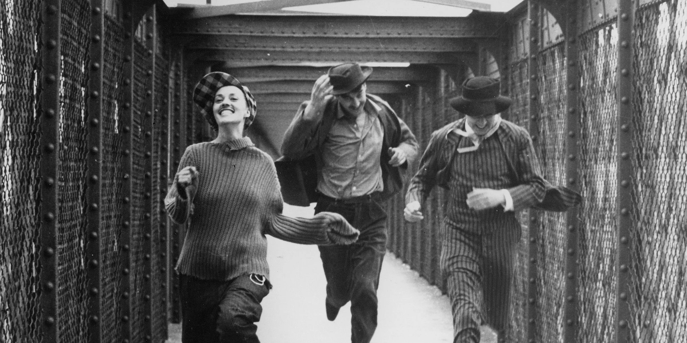
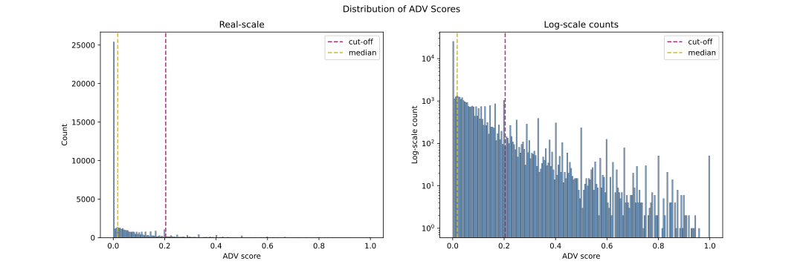
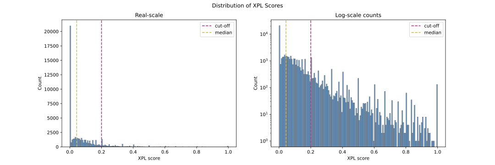
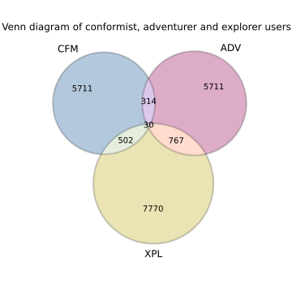
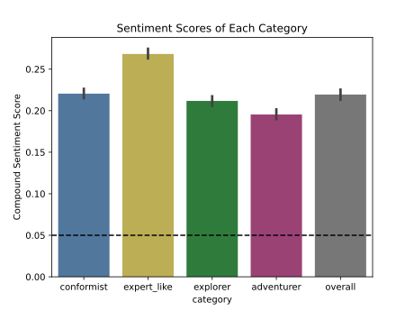



## <a id="section_intro">Introduction</a>
Welcome to the captivating world where stories unfold, emotions intertwine, and characters come to life on the silver screen! Our project embarks on a riveting journey through the heart of cinema, seeking to decode the intricate dance of characters within the vast tapestry of movie plot summaries.

In the grand tradition of narrative storytelling, characters serve as the beating heart of every cinematic masterpiece. Beyond their individual narratives, the dynamics between characters shape the essence of storytelling, steering plots towards climactic peaks, heartwarming resolutions, or tragic conclusions.

Why is understanding character dynamics so crucial? Well, as storytelling enthusiasts, filmmakers, and data enthusiasts alike, we believe that unraveling the patterns of character interactions unveils the very essence of cinematic storytelling. Characters are not mere entities; they are conduits through which narratives breathe, conveying emotions, conflicts, and resolutions.

Academic Touchpoint: 🎓 As echoed by film theorist André Bazin, "A film is a petrified fountain of thought." Our journey aligns with this sentiment, aiming to unlock the flow of narrative thought embedded in character interactions.

Buckle up as we embark on an odyssey through the realms of persona distributions, intricate character networks, and the pulsating rhythm of cinematic evolution! 🚀 Are you ready to peer into the soul of cinema and witness the magic that unfolds when characters take center stage? Let the curtain rise, and let the data story begin! 🌟

<i>1natural soft-clustering: this approach is "cluster together users that satisfy a human-interpretable condition" （for modification </i>

## <a id="section_dataset">Dataset</a>
We use the [dataset](https://drive.google.com/drive/folders/1Wz6D2FM25ydFw_-41I9uTwG9uNsN4TCF) provided by the teaching team of "CS-401: Applied Data Analysis" at EPFL for the year 2022.

## <a id="section_clustering_approach">The Approach to Soft-Clustering the Users</a>

We use a score-based approach to soft-cluster users using scores that are easily interpretable to humans. All of our scores satisfy that the larger they are the more they emphasize that the user may belong to the given category.

## <a id="section_1">Single Character Analysis</a>
### ** Persona Distribution Analysis:** 
Introduction:
Welcome to the fascinating world of movie personas! In this section, we delve into the distribution of character personas among the vast landscape of movie plot summaries. As we explore, keep in mind the temporal and genre dimensions, as they play pivotal roles in shaping the rich tapestry of characters in cinema.

Persona Distribution Across Genders:
Our journey begins by examining how character personas are distributed across genders. Visualizing the data reveals intriguing patterns. Over the years, we observe a shift in the dominant personas for both male and female characters. Are traditional gender roles evolving? Let's find out!

Persona Distribution Among Main and Side Characters:
Zooming in, we scrutinize the personas assigned to main and side characters. Unveiling the nuances of their interactions, we discover that main characters often embody personas associated with pivotal actions, while side characters contribute unique flavors to the narrative. How do these roles intersect with genres?

Intersectional Persona Analysis:
Now, let's explore the intersectionality of personas. Are certain personas more prevalent among male main characters or female side characters? We uncover fascinating dynamics that challenge stereotypes and add depth to our understanding of character personas in film.

  
Show more

  
  A user $u$ is a conformist if he/she has a high conformism score that measures how much the user sticks with the average opinion on the beers he/she rates. The score is defined as follows:

  $$CFM_u = -\frac{1}{B_u} \sum_{b \in B_u} (\frac{r_{u,b}-\overline{r_b}}{\sigma_b})^2$$
  
  $B_u$ is the set of beers the user $u$ has rated.
  
  $r_{u,b}$ is the rating given by user $u$ to beer $b$.
  
  $\sigma_b$ is the standard deviation of the ratings of the beer $b$.

  $\overline{r_b}$ is the average rating of beer $b$.
   

 

## <a id="section_2">Interaction Analysis by Gender</a>
### **Interaction Analysis by Gender: Harmony and Discord on the Silver Screen** 
In this act of our cinematic exploration, we focus our lens on the delicate dance of characters, specifically examining the interplay between genders. As characters navigate the intricate plots of movies, their interactions become a symphony of emotions, actions, and dialogues.

🌟 Unveiling the Gender Dynamics:
Picture this – a tapestry of character interactions where male and female protagonists engage in a harmonious ballet of emotions. Our analysis has unraveled the most common interactions between characters of the same gender. Do they share tender moments of camaraderie or clash in the tempest of conflicts?

Academic Insight: 📚 Drawing inspiration from Carol Gilligan's work on gender and moral development, we scrutinize not just what characters do but how they connect emotionally.

👫 Male-Male Connections: Enter the world of bromance and camaraderie. Do male characters primarily engage in the pursuit of shared goals, building friendships that weather the storms of their cinematic adventures?

👭 Female-Female Bonds: Amidst the storytelling tapestry, female characters forge connections. Are these bonds characterized by solidarity, sisterhood, or perhaps the shared pursuit of common objectives?

💑 Male-Female Duets: Ah, the dance of opposites! Venture into the realm of interactions between male and female protagonists. Is it a dance of romance, conflict, or a nuanced blend of both? The silver screen often mirrors the ebb and flow of relationships.

📈 Temporal Evolution: Let's set our cinematic time machine in motion. How have these gender dynamics evolved over the years? Do cinematic narratives reflect changing societal norms and expectations?

As we peer into the kaleidoscope of gendered interactions, our data-driven journey promises to unveil the nuanced dynamics that underpin the relationships between characters on the silver screen. 🎭 Are you ready to decode the secrets of gendered storytelling in cinema? Join us as we navigate through the emotional landscapes of male-male, female-female, and male-female character interactions! 🍿✨

<i>Note that 94.5% of rated beers in the data available to us have a BA score.</i>

For lack of a better name, we will reference these users as the EXP users referring to a somewhat "structured" way of rating beers that may indicate being influenced by the BA score displayed on the website.

  
Show more

  A user $u$ is an EXP user if he/she rates, on average, beers close to their BA score scaled down to the range [0, 5] using the following piecewise linear mapping based on the <a href="https://www.beeradvocate.com/community/threads/beeradvocate-ratings-explained.184726/">BA score range and meaning revealed by the website's administrators</a>, to which we believe this mapping corresponds best:
  
 {world class : 95 - 100 mapped to ]4.75; 5], outstanding : 90 - 94  mapped to ]4.5; 4.75], very good : 85 - 89  mapped to ]4; 4.5], good : 80 - 84  mapped to ]3.5; 4], okay : 70 - 79  mapped to ]3; 3.5], poor : 60 - 69 mapped to ]2; 3], awful : <= 59 mapped to ]0; 2]}.
  
  The score is defined as follows:
  
  $$EXP_u = -\frac{1}{|B_u|} \sum_{b \in B_u} (\frac{r_{u,b}-BA_b}{\sigma_b})^2$$

  $B_u$ is the set of beers rated by user $u$.
  
  $r_{u,b}$ is the rating given by user $u$ to beer $b$.
  
  $\sigma_b$ is the standard deviation of the ratings of the beer $b$.
  
  $BA_b$ is the BA score a beer $b$. 

 

## <a id="section_3">Interaction Analysis by Character Type</a>
### **Interaction Analysis by Character Type: Main Characters and Side Characters Through Time and Genre**
Lights, camera, dimensions! In this segment of our cinematic odyssey, we journey through time and traverse the diverse landscapes of genres to uncover the secrets hidden within the dynamics between main and side characters.

🌟 Main-Main Connections:
As we step across cinematic eras, observe how the interactions between main characters have evolved over time. Do the romantic dialogues of yesteryear differ from the action-packed exchanges of the modern era? Time, it seems, leaves an indelible mark on the relationships between protagonists.

Academic Glimpse: 🎓 Channeling the insights of film historian David Bordwell, we contemplate the impact of changing film techniques and narrative structures on the dynamics between main characters across different cinematic periods.

👥 Side-Side Bonds:
Now, let's journey through genres, where the roles of side characters unfold against distinct backdrops. Are the side-side bonds of a classic film noir different from those in a contemporary romantic comedy? Immerse yourself in the genre-specific nuances that shape the interactions between supporting characters.

🌐 Main-Side Interactions:
Venture through time and genres as we unravel the intricate dance between main and side characters. Do these interactions adapt to the storytelling conventions of film noir, comedy, or science fiction? The evolution of character dynamics becomes even more pronounced as we navigate through both temporal and genre dimensions.

📈 Temporal Evolution and Genre Extravaganza: Beyond mere exploration, let's synchronize the ticking of the clock with the beats of different genres. How have the interactions between main and side characters changed over time within specific genres? Do certain genres dictate unique character dynamics that transcend temporal boundaries?

As we embark on this multidimensional exploration, the narrative unfolds, weaving together the threads of time and genre into a rich tapestry of character dynamics. 🌌 Join us on this immersive journey through cinematic eras and genre landscapes, where characters, both main and side, play their roles in the ever-evolving story of the silver screen! 🎭🍿

  
Show more

  This score provides us with information about which users contribute to enriching the experience on the website, either because they rate beers that do not get much attention, or because they "introduce" new beers on the website by being the first people to rate those beers.
  
  A user $u$ is an explorer if, often enough, among the beers he rated, he/she was among the first 10 users to rate that beer. The score is, therefore: 

  $$XPL_u = \sum_{b \in B_u} \mathbb{1} [u \in U_{10}(b)]$$

  $B_u$ is the set of beers rated by user $u$.

  $U_{10}(b)$ is the set of at most 10 users that first rated the beer $b$.
  

 

## <a id="section_4">Intersectional Analysis</a>
### **Intersectional Analysis: Where Gender and Character Type Converge**
The stage is set for a detailed exploration of character dynamics as we unfold the intricacies of four key combinations: Male-Main, Male-Side, Female-Main, and Female-Side. Each combination tells a unique story, revealing the dynamics that underpin the interactions between characters of different genders and roles.

1. Male-Main Characters:
🎭 Behind the Masculine Lens

How many male main characters grace the cinematic canvas? Unveil the personas that embody the essence of the narrative.
Dive into the interactions between male main characters. Are they bound by shared pursuits, rivalries, or collaborations? Explore the emotional landscapes that unfold within this dynamic group.
2. Male-Side Characters:
🎬 Supporting Roles in Focus

Shine the spotlight on male side characters as they add depth and complexity to the narrative. How do their roles influence the overarching story?
Analyze the interactions between male side characters and other character types. Are they amplifying the journeys of the main characters or crafting unique subplots?
3. Female-Main Characters:
🌟 Leading Ladies in Action

Illuminate the screen with the presence of female main characters. What personas define their roles, and how do they shape the narrative arc?
Delve into the interactions between female main characters. Are their connections characterized by solidarity, competition, or a blend of both? Uncover the emotional layers that unfold within this ensemble.
4. Female-Side Characters:
🌈 Side Characters Stepping Forward

Acknowledge the roles played by female side characters, often the unsung heroes of the cinematic narrative. How do they contribute to the richness of the story?
Investigate the interactions between female side characters and other character types. Do they forge unique bonds or add intricate layers to the relationships within the narrative?
📊 Quantifying the Ensemble:
Before the characters take their places on the stage, let's quantify the ensemble. How many characters fall into each category? Are there notable trends or imbalances that catch the eye?

🌐 Temporal Evolution and Genre Dimensions: As we traverse through time and explore various genres, how have the numbers and interactions within each character category evolved? Does the cinematic landscape reflect changing societal norms and storytelling conventions?

As we unveil the personas and interactions within each character combination, a vivid narrative unfolds, shedding light on the intricate dance of characters within the intersectional realms of gender and roles. 🎥 Join us as we unravel the stories woven into Male-Main, Male-Side, Female-Main, and Female-Side character dynamics, where each combination contributes to the symphony of cinematic storytelling! 🍿🎶

  
Show more

  
  A user $u$ is an adventurer if he/she often enough risks trying out beers that have a bad rating at the time at which they rate them (less than 3.25/5, knowing that the average is at $\approx$ 3.97/5). The corresponding score is the following:

  $$ADV_u = \sum_{b \in B_u} \mathbb{1} [\overline{r}_{u,b}(t_{u,b}) < T]$$

  $B_u$ is the set of beers rated by user $u$.

  Rating $\overline{r}_b(t_{u,b})$ is the average rating of beer $b$ at the time $t_{u,b}$ at which user $u$ rates beer $b$.

  $T=3.25$ is a cut-off determined empirically based on the data.

 

## <a id="section_clustering">User Clustering</a>

In order to choose adequate thresholds to classify the users based on the scores defined in the previous section, we look at the distributions of these scores. The figures below plot those distributions in real and logarithmic scales:

The adventurer score has a heavy-tail distribution. By the interpretability of this score, a cut-off or threshold at 0.2 classifies as adventurers the users for which at least 20% of the beers they rate have a slightly okay at best rating at the moment at which they rate them. We use this threshold that corresponds to the $90^{th}$ percentile of the ADV score distribution.
    
 

The conformist score also has a heavy-tail distribution. Here again, we choose the threshold that corresponds to the $90^{th}$ percentile that is -0.35, which by the interpretability of this score means that we classify as conformists the users who deviate on average by less than 0.35 from the average opinion.
    
 

The EXP score looks more like a skewed gaussian, but it is not since it is heavy-tailed. Again by the interpretability of this score, a threshold at -0.2 classifies users that deviate on average by less than 0.2 from the displayed BA score as EXP users.
   
  

The explorer score also follows a heavy-tailed distribution. To reiterate, by the interpretability of this score, given a threshold of approximately 0.2, we classify as explorers the users that figure in the first 10 raters of at least 20% of the beers they rate.

### <a id="section_overlap">To What Extent Do the Categories Overlap?</a>

Since we do soft clustering, users have a score for each category. But how users who meet the threshold score be in multiple categories? We used a simple Venn diagram to visualize the overlap of categories. The Venn diagram shows the number of users for the categories CFM, ADV, and XPL, and the number of users who are at the intersection of multiple categories.

 

As we can see, there are very few overlaps between explorers, conformists, and adventurers. There are some users with two categories, but almost no users with all 3 categories. This suggests that the categories that we defined target different kinds of users.

# <a id="section_story">The Story Overview</a>
In the following sections, we will study the categories defined previously on many levels: beer style preferences, locations, ratings, reviews...etc to extract as much information about these categories as possible to build relevant personas that can be leveraged by the administrators to improve the UX of their website.

## <a id="section_ratings_reviews">How Does the Number of Ratings and Reviews Characterize the Categories?</a>

In this section, we highlight the ratings and reviews tendencies of the four categories: XPL, ADV, CFM, and EXP.

In order to know if the number of ratings characterizes in some way each category, we plot the likelihood of a user belonging to a category as a function of the range in which his/her number of ratings falls. Each range corresponds to an inter-quantile range of around 25% of the density of the number of ratings of all the studied users. As a quick reminder, those are the users from English-speaking countries having at least 5 ratings. The figure below shows the result.

It is worth pointing out that we only consider 99% of the density as the remaining 1% contains only super users which have many folds more ratings than normal users. Since there are very few super users, their results may be non-conclusive because they may be non-representative of super users overall that is why we treat them as outliers and discard them here.



We notice the following trends:
* Adventurers (ADV) are more likely to have fewer ratings (100 ratings at most), but could also have more ratings. The probability is however almost halved for subsequent ranges where the number of ratings is larger than 100.
* Conformists (CFM) are more likely to have many more ratings (more than 500 ratings).
* Explorers (XPL) are almost as likely to have very few or many more ratings (more than 500 ratings).
* EXP users (EXP) mostly have very few ratings (10 at most) and become quickly significantly less likely as the number of rating increases.

We can therefore deduce the following:
* Adventurers (ADV): the more ratings a user has, the less likely he/she tends to try out not-so-good beers. This is not explained by the unwillingness of users with many ratings to try bad beers, but rather by the fact that the average beer rating is quite high ($\approx$ 3.97/5 overall) so users who have a lot of ratings end up rating beers that on average have a good score which reduces the percentage of bad beers they rate and thus throws them off being classified as adventurers.
* Conformists (CFM): the users who rate on average close to the average rating of a beer tend to have many ratings, unabiding by what one could expect.
* EXP users (EXP): the users that rate beers close (0.2 average deviations from the true value) to the piecewise linear mapping of the BA score to the range [0, 5] do so unintentionally since they tend to have very few ratings. We can already deduce that the display of the BA score on the website has no significant influence on the way the users rate the beers.
* Explorers (XPL): the users who tend to rate newly introduced beers or introduce new beers are more likely to have many or very few ratings.

In the same spirit, we filter the users having at least one review and repeat the process. The figure below shows the result:



This time, we highlight the most important trend which is that the explorers (XPL) are overall the most likely to provide a review for the beers they rate.

## <a id="section_countries">Are There More Users from a Specific Country for Certain Categories?</a>

For our analysis, we took only users from the USA, Canada, UK, and Australia. Note that most users in [BeerAdvocate](https://beeradvocate.com) come from the USA. Is the distribution of country the same for all categories? The following interactive plot (you can select a category) shows the distributions of countries for the users for all users (ALL), conformist (CFM), explorer (XPL), adventurer (ADV), and EXP users.



We can conclude from the plot that conformists (CFM) and EXP users (EXP) have the same country distribution as the distribution of all users regardless of categories.  
However, we see a different distribution for explorers (XPL) and adventurers (ADV), with a higher proportion of users from these categories coming from Canada, England, and Australia. This could potentially be due to a tendency for these users to rate beers from their own country or region more often. Indeed, since Canadian, English and Australian beers are rarer in [BeerAdvocate](https://beeradvocate.com), if the users from these countries rate the beers from their country more, they are more likely to rate beers with few or bad ratings.  

The pie chart shows only the distribution of categories at the country level. However, we need to zoom into the USA to have a bigger picture since it's where most users on [BeerAdvocate](https://beeradvocate.com) come from. In order to get a clearer look at these disparities per location, we can decompose the USA into the different existing states. The following plot shows the distribution of the US state by categories.



 Clearly, there is a high disparity in the percentages of users per location. CFM and EXP vary between twice and once time the overall categories value (10% and 3% of the user respectively). However, the XPL and ADV categories have higher disparities with Austria, England, and Canada having extremely high percentages. 60% of Austrian users are explorers this is more than 4 times the overall percentage of 13%. The concentration of XPL in these countries can be explained by the extremely low number of selected users in these countries. Austria 229 Canada 1593 and England 329. This is in fact so low that when a user rates a local beer there is a high chance that this beer has been rated less than 10 times in the meantime classifying them as XPL. In order to explain the ADV spike in these countries we can look at the average rating of the beers that these 3 countries' users rate indeed Austria is the country with the users rating the beers with the lowest average rating (3.64), England is the second (3.70) and Canada is the 4th (3.75). This explains why Australian, English, and Canadian users tend to rate beers with a low average rating and be classified as ADV.
  
## <a id="section_beers">Do Different Categories Have Different Beer Preferences?</a>

### Do users belonging to different categories on [BeerAdvocate](https://beeradvocate.com) have similar preferences for the region of origin of beers?

Some regions in the world have a high reputation in terms of brewing beers. We will first analyze in which country the beer was brewed and where the ratings of users go to. The following interactive plot (you can click on categories) shows, for each category, the percentage of ratings that go to each location (US state and countries) ranked by highest percentage first.
  

  
We can see a similar pattern for all categories: they rate beers from where they come from a lot. Indeed, we see that most ratings go to the most populous states of the US. However, by selecting adventurer (ADV) and overall (ALL) only on the plot, we see that adventurers, while still rating beers from California a lot, have a different behavior than the general rater. By selecting only adventurer (ADV) we see that they also rate beers from other countries a lot, such as beers from Canada, Germany, Belgium, and England for example.  
While Canada and England may not be surprising, since a lot of adventurers come from these two countries. The other countries are more surprising since there are no users from Belgium and Germany among the users we considered. Beers from Belgium, which are very famous have a high percentage of ratings across all categories, however, 5% of ratings from adventurer users go to beers brewed in Germany, while only 2% of ratings from users, in general, go to beers brewed in Germany. It seems like adventurers are more likely to rate beers from other countries compared to the other categories. 
This behavior can be compared to explorers who also rate a lot of beers coming from Canada (we see that many explorers are Canadian), but they don't rate beer from Germany as often as adventurers do.

We see that adventurers (ADV) don't rate the same kinds of beers compared to the other user categories. However, do they have similar likings in terms of beer provenance? The following interactive plot (you can click on a category) shows the ratio between the average rating for each location compared to the average rating of a category of users. If the average rating for a location is above 1 (the dashed line), it means that users from the selected category like beers from that location more compared to the other beers they rated.


  
By selecting all categories, we see that conformists (CFM), EXP users, and explorers (XPL) mostly agree on the best beer provenances. Moreover, they all have similar likings compared to users in general (ALL).
However, adventurers have different preferences. By clicking on adventurers (ADV) and overall (ALL) on the plot, we see, for example, that they like beers from Belgium more compared to the general users (ALL). There is also a huge difference in beers from Scotland. Overall, they have very different opinions compared to the other categories.

### Do users from different categories like the same beer styles? 

Now that we concluded that conformists (CFM), EXP users, and explorers (XPL) have similar behaviour in terms of ratings of beers towards the location of origin of beers and that adventurers (ADV) have different behavior. We can see our conclusion also applies to beer styles, which is also a very opinionated topic. 
The following interactive plot (you can click on categories) is similar to the first plot for the location of the origin of beers. It displays for each category, the percentage of ratings that go to each bear style ranked by highest percentage first. 


  
When we select the users overall (ALL) and conformist users (CFM) on the plot, we see that these two categories are very similar in terms of percent of ratings for beer styles.
However, by selecting ALL again and EXP or explorer users (XPL) we see a similar ranking, but the distribution is not the same. This motivates the idea that conformists are the closest user to the lambda user.  
Finally, we see a very different ranking and distribution for the adventurers. It seems like they rate very different styles of beers compared to the other users.

We then compare the likings of each category in terms of beer style to see if a beer style is more liked by some categories. The following interactive plot (you can click on a category) shows the ratio between the average rating for each beer style compared to the average rating of a category of user. If the average rating for a beer style is above 1 (the dashed line) it means that users from the category selected like more beers from that beer style compared to the other beers they rated.



Conformists, explorers, and EXPs rate style of beers similarly compared to their average rating. Additionally, it seems like they all agree that "Gueuze", a Belgian style of beer, is the best style overall.  
The only category that doesn't agree with this consensus is the adventurer category: The Gueuzes are only ranked 11 in their ranking. Their preferred style is quadruple, which is also Belgian and according to the website, it's not a very common type of beer in the USA (where most users of [BeerAdvocate](https://beeradvocate.com) come from). Another interesting result is that, while adventurers are users who rate beers with a bad average rating, they tend to rate quadruple beers a lot according to the plot before showing the percentage of ratings. It reveals that, even though adventurers rate a lot of bad beers, they also rate a lot of beers they like.

The following plot show what are the most disliked style of beers for adventurer users (ADV). It's the same kind of plot as above but focuses only on adventurers and ranks the beer style by worst normalized average rating first.



We notice that the American Adjunct Lager is present while being the beer they rate the most. We can also notice other beers that they rate a lot while considering it not good (eg. Euro Pale Lager), suggesting that they rate a lot of beers that they don't like. However, this could be false to conclude that they only rate beers they don't like. For example, their second most-rated beer is American IPA, which is very popular with all users, and they don't seem to dislike them. This suggests that their behavior is not orthogonal to the general user.

## <a id="section_sent_analysis">How Does Reviews' Sentiment Analysis Compare to Ratings for each Category?</a>

The different user categories don't have the same average rating: $\approx$3.92/5 for conformists (CFM), $\approx$4.39/5 for EXP users, $\approx$3.8/5 for explorers (XPL) and $\approx$3.45/5 for adventurers (ADV). The difference for ADV is explained by the fact that they rate badly rated beers by definition, so they are more likely to give bad ratings themselves. But how is this difference in average rating reflected in the sentiment of the reviews?
We performed a sentiment analysis on the reviews of the users of each category and a sample of users took uniformly regardless of their category. The following plot shows the average "compound sentiment" for the beer reviews of each category using the Vader sentiment analyzer. The compound sentiment is considered a positive sentiment if its value is above 0.05, neutral if it's between 0.05 and -0.05, and negative if it is below -0.05.  

  
Sentiments of review are mostly very positive for each category. The average sentiment is significantly above the threshold for positive sentiment. Conformist, explorers have the same average sentiment as the general user. However, EXP are slightly more positive, and adventurers are slightly more negative compared to the general user.
The disparity between the categories can be explained by the average rating, which is different for each category as we mentioned above. However, the difference in average rating between categories is not fully translated into sentiment analysis. Although the difference in average rating is huge between adventurers and the general user ($\approx$3.45 vs $\approx$3.89 for users in general), the difference in average sentiment is not that noticeable. This suggests some kind of "regression to the mean" phenomenon: Adventurers may have some reviews which may be more negative compared to the average review, the average sentiment of an adventurer seems to tend towards the average sentiment of beer reviews in general for [BeerAdvocate](https://beeradvocate.com) though, which seems to be quite positive.

<!-- Farouk -->
## <a id="section_time_analysis">What Categories Does the Website Attract Most Overtime?</a>
In this section, we shed light on the attractiveness of [BeerAdvocate](https://beeradvocate.com) for each user category over time. Firstly, we look at the yearly increments in the number of new users broken down by category. The figure below shows those increments for the period spanned by the data:



Considering the total yearly increments of new users belonging to all categories combined to be a measure of website popularity, one can grasp from the plot above that the website rapidly grows popular over the years to reach a peak of popularity in 2014 before dropping down in subsequent years. Additionally, the main categories  (ADV, CFM, and XPL) contribute differently but consistently to these increments over time. We notice a dominance of the explorers (XPL) in general except in 2012 and 2013 where the adventurers (ADV) and conformists (CFM) have the majority respectively. So far, we can already deduce the following:
* In most years, the website attracts more explorers (XPL) than any other category. As a quick reminder, those are the users whom around 1 in 5 beers they rate are beers newly introduced to the website since they have at most 10 ratings at the time these users rated them. These users have consistently contributed the most to the popularity of the website, or equivalently, the website has consistently attracted this kind of users most over the years. It is therefore no secret that [BeerAdvocate](https://beeradvocate.com) has been consistently a good website for users willing to explore new beers.
* Even if the explorers (XPL) dominate, the website consistently attracts a decent variety of users between conformists (CFM) and adventurers (ADV). This is emphasized by the fact that, even though we perform soft-clustering of users so each user can belong to more than one category, there is no major overlap between the three categories as shown by the Venn diagram of section "Categories' Overlap" so the trends are almost independent.
* The website has known a big surge in its number of users in 2014, which is the period highlighted, more than any other year. This surge is led by the explorers (XPL).

We take our analysis a step further to understand the reason behind the surge in 2014. We plot the yearly contribution per category to the percentage of new classified users below:



We naturally expect the largest explorers to dominate in the first few years as the website gets populated by new beers and there is still much to explore. On the other hand, in this plot, we can clearly see that a significant contribution of adventurers (ADV) has started early on and has been subject to little variance over the years. We can deduce, assuming our categories describe a broad enough spectrum of possible high-level user classifications that may be of interest to the administrators, that [BeerAdvocate](https://beeradvocate.com) has had a more or less consistent base of adventurers (ADV) joining the website. This is good news as one may wonder if the "labeled" not-so-good beers would ever have a chance to be tried by the users. The answer is yes they do, and consistently.

Let us focus on the highlighted period corresponding to the year 2014. We clearly see a decrease in the share of conformists (CFM), a quasi-stagnation of the share of adventurers (ADV) but a quick increase in the share of explorers (XPL). To uncover the reason behind the 2014 surge in popularity, we again take our analysis a step further and plot the monthly increments per category in the numbers of new users in 2014 below. The highlighted period corresponds to that between and including May to July.



In the highlighted period, the sharp increase in the increment of the explorers (XPL) stands out since it doubles in one month and almost triples in two months, with respect to May. However, prior to May of the same year, the contributions of the three major categories are rather comparable. 

Accounting for the fact that we study the users from English-speaking countries, 96% of them being from the USA since the website is most popular there, we were able to point out one major event that could explain this surge and that happened in the same period, around mid-May 2014, that is <a href=" https://www.craftbeer.com/news/american-craft-beer-week">American Craft Beer Week</a>. To sum it up, this is an event in which beer lovers get to explore and try new beers out from a variety of breweries. We believe that such an event, if not that event in particular, may have contributed to this surge in explorers (XPL), which in turn dominated the yearly increment of new classified users in 2014, which in turn contributed the most to the popularity of the website. This is another result that emphasizes how much [BeerAdvocate](https://beeradvocate.com) is attractive to people willing to explore new beers.

## <a id="section_personas">Categories' Personas</a>

We converge our previous results into a summary of category personas that describe each category:

### Explorers (XPL)
* Explorers are overall the most likely category to provide reviews.
* Explorers are more likely to have many (more than 500) or very few (less than 50) ratings.
* Explorers have a tendency to live in countries outside of the USA (Austria, England, Canada).
* The website attracts explorers more than any other categories over the span of the data.
* Explorers may believe that beer advocate is a good platform to explore new beers because of the rush in users joining the website during and right after American Craft Beer Week 2014.

### Conformists (CFM)
* Conformists are the most similar to the average user among all the categories since they don’t deviate from the average user in terms of the beers they like and rate.
* Conformists are more likely to have a lot of ratings (more than 500) than fewer ratings.
* Conformists are more likely to provide many reviews (more than 150) when they do provide them.

### Adventurers (ADV)
* Adventurers with a few reviews (less than 150) are more likely to provide reviews compared to adventurers with a higher number of ratings.
* Their reviews have a similar sentiment compared to the other categories, while having an average rating well below the other categories.
* They do not only rate bad beers, they also rate beers they consider good, for example the Quadrupel beers.
* They are the most likely to try a beer which comes from a different country than theirs, they rate a lot beers coming from Germany for example.
* They have very different preferences in terms of beers compared to the other categories whose preferences are quite similar, their ranking in terms of most liked beer for style and country of origin is totally different compared to the other categories.
* Adventurers are more present in certain countries (Austria, England, Canada).

### EXP users (EXP)
* EXP users are unlikely to have more than 50 ratings. They tend to have very few ratings, as the majority is below 10 ratings.
* When EXP users provide reviews, they are unlikely to provide a decent number of reviews (more than 10) compared to the other categories.

## <a id="section_takeaways">Takeaways</a>
In light of our analysis and the personas we built, we would like to highlight the following improvements that could be made to the website:

* Since the users that almost consistently top the contribution to the website’s popularity are explorers, the website’s administrators could benefit from adding features to their website that help users explore new beers in their area.
* Having many explorers is in turn useful to boost the number of reviews in the website, since they are the most likely to provide reviews aside from possibly introducing new beers and enriching the website’s database.
* Displaying the BA score does not really influence the user ratings since the EXP users tend to have very few ratings. Additionally, conformists do not dominate the website so we can eliminate the idea of any global herding effect damaging the user experience.
* The website has been attracting adventurers consistently throughout the years so some features like displaying an ordering of beers per category via the BA score does not make users reluctant to trying beers with bad ratings. These users help make underrated beers more popular or confirm that bad beers are just bad.
* The website could benefit from a sales system to allow users to try local beers but also international ones since the adventurers are willing to try beers from other countries for instance.

On the other hand, this analysis is an example of a successful natural soft-clustering approach to grasp the user tendencies by category and to build personas that can be useful to improve the underlying service or platform, in particular to improve UX. We believe our approach could be fruitful in services that rely heavily on recommender systems where understanding and characterizing different user categories may be helpful in predicting the best item suggestions.
