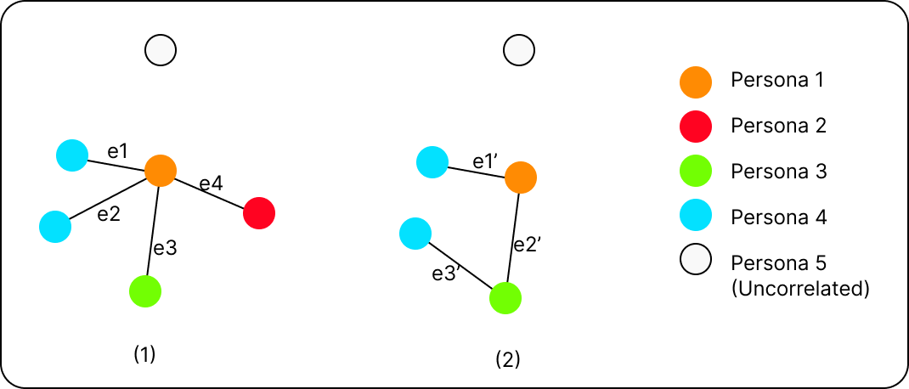

For temp files.

Semantic character network comparison
We define our character network as $G = (V, E)$, where the vertices represent the characters in the plot and the edges represent the interaction between the two characters. After constructing this network, we map each character to specific personas, as depicted in the diagram below.

After we get the persona network for each film, we "rebuild" the plot through theses networks. Our objective is to compare the similarity (or difference) between these networks, focusing on two aspects: node and edge overlaps. The following image demonstrates two networks with certain overlaps in both nodes and edges. We will use the Jaccard index [[1]](https://en.wikipedia.org/wiki/Jaccard_index) to compute the node set similarity and the edge set similarity.
$$J(A,B) = {{|A \cap B|}\over{|A \cup B|}} = {{|A \cap B|}\over{|A| + |B| - |A \cap B|}}$$

**Node set similarity**
For node set similarity, we just count the number of shared personas of two networks. In the example above, network (1) and (2) have 5 shared nodes.

**Edge set similarity**
Edge set similarity is a stricter measure. We consider two edges identical if they connect the same nodes and exhibit the same (or very similar) semantic connections. Assuming e1=e1', e2=e2', we have 2 shared edges in the example above.

